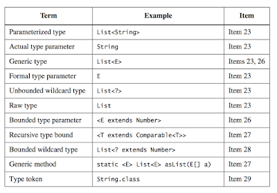

##로 타입은 사용하지 말라
* 제너릭 클래스, 제네릭 인터페이스
  * 클래스와 인터페이스 선언에 타입 매개변수(type parameter) 사용
    * ex> `List<E>` - List of E
  * 둘을 합쳐서 제네릭 타입(generic type)이라 부름
  * 제네릭 타입은 매개변수화 타입(parameterized type)의 집합을 정의
    * ex> 매개변수화 타입 : `List<String>`
      * String은 E에 해당하는 실제(actual) 타입 매개변수
  * 제네릭 타입을 정의하면 그에 딸린 로 타입(raw type)도 함께 정의
    * 제네릭 타입에서 타입 매개변수를 전혀 사용하지 않는 경우
      * ex> `List<E>`의 raw type : List
* 컬렉션의 로 타입 잘못 사용한 예제 (code)
```
  final Collection stamps = new ArrayList(); // Stamp 인스터스만 취급
  stamps.add(new Stamp());
  stamps.add(new Coin());  
  for( Iterator i = stamps.iterator(); i.hasNext(); ) {
    Stamp stamp = (Stamp) i.next(); // ClassCastException 발생
  }
```
*
  * 에러가 발생하는 지점과 원인이 되는 지점이 다름(디버깅 힘듬)
  * 컴파일할 때 발견하는 것이 좋음
  * 주석은 컴파일러가 이해하지 못하니 큰 도움이 안됨
* 해결책
  * 제네릭 활용
  * 컬렉션에서 원소를 꺼내는 곳에 보이지 않는 형변환을 추가
```
  final Collection<Stamp> stamps = new ArrayList<>(); 
```
* 로 타입을 쓰지 말자
  * 안정성과 표현력 모두 약해짐
  * 로 타입 존재 이유
    * 제네릭이 없던 시절과의 호환성을 위해 존재
      * 제네릭 구현에는 소거 방식 사용(item 28)
* `List` vs `List<Object>` (code)
  * `List`
    * 로 타입
    * List를 매개변수로 받는 메소드에 List<String> 넣는거 가능
  * `List<Object>`
    * 매개변수화 타입
    * `List<Object>`를 매개변수로 받는 메소드에 `List<String>` 넣는거 불가능
* 비한정적 와일드카드 타입(unbounded wildcard type) (code)
  * `Set<?>`
    * 제네릭 타입인 Set<E>의 비한정적 와일드카드 타입
    * 가장 범용적인 매개변수화 Set 타입    
    * 실제 타입 매개변수가 무엇인지 신경 쓰지 않고 사용 가능
  * `Set<?>` vs `Set`
    * `Set<?>`
      * 제네릭 타입을 사용
      * 안전
      * 어떤 원소도 넣을 수 없다. (code)
    * `Set`
      * 로 타입
      * 위험
* 로 타입을 사용해야 하는 경우
  * class 리터럴
    * class 리터럴에 매개변수화 타입을 사용하지 못하게 함(배열과 기본 타입은 허용)
    * `List<String>.class`와  `List<?>.class` 허용 안함
  * intanceOf 연산자는 비한정적 와일드카드 타입 이외의 매개변수화 타입에는 적용할 수 없음
```
// 로 타입 사용의 좋은 예
if( o instanceof Set) { // 로 타입
  Set<?> s = (Set<?>) o;  // 와이드카드 타입
}
```

   
   