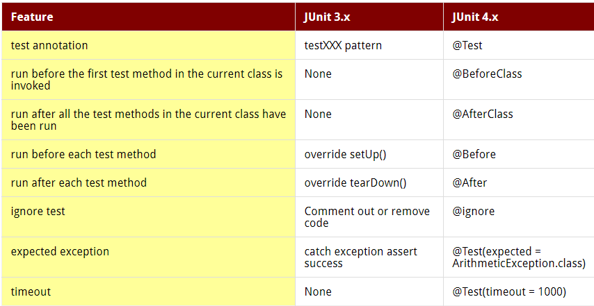

##명명 패턴보다 애너테이션을 사용하라

* 명명 패턴
  * 문제점
      * 오타 발생시 무시될 수 있음
      * 올바른 요소에서만 사용되리라 보증할 방법이 없음
      * 프로그램 요소를 매개변수로 던질 수 없음
        * ex> 특정 예외
* 애너테이션 
```
/**
 * 테스트 메서드임을 선언하는 애너테이션
 * 매개변수 없는 정적 메서드 전용
 */
@Retention(RetentionPolicy.RUNTIME)
@Target(ElementType.METHOD)
public @interface TestCustom {
}
```
  * 메타애너테이션(meta-annotation) 
    * 애너테이션 선언에 다는 애너테이션
    * @Retention(RetentionPolicy.RUNTIME)
      * 런타임에도 @TestCustom이 유지 
    * @Target(ElementType.METHOD)
      * 메소드 선언에서만 사용
  * 주석
    * "매개변수 없는 정적 메서드 전용"
      * 애너테이션 처리기를 직접 구현해야만 컴파일러에서 검출 가능
      * 직접 구현없이 인스턴스 메서드나 매개변수에 애너테이션을 달 경우 (code - sample1)
        * 컴파일 잘 됨
        * 테스트 도구 실행시 실패
  * 마커(marker) 애너테이션
    * 매개변수 없이 단순히 대상에 마킹(sample1 - @TestCustom)
  * sample1 분석
    * 4개의 테스트 중 1개 성공, 2개 실패, 1개 잘못 사용
    * 애너테이션이 붙지 않은 메소드는 테스트 도구가 무시
    * 대상 코드의 의미는 그대로 둔 채 애너테이션에 관심 있는 도구에서 특별한 처리를 할 기회를 줌
      * ex) RunTests
  * sample2 분석 (code - sample2)
    * 매개변수를 하나 받는 애너테이션 타입
      * Class<? extends Throwable>
  * sample3 분석 (code - sample3)
    * 배열 매개변수를 받는 애너테이션 타입
  * sample4 분석 (code - sample4)
    * @Repeatable 메타 애너테이션 이용
      * @Repeatable 단 애너테이션은 여러번 달 수 있음
      * 주의점
        * @Repeatable을 단 애너테이션을 반환하는 '컨테이너 애너테이션'을 정의해야함
          * @Repeatable에 컨테이너 애너테이션을 전달
        * 컨테이너 애너테이션은 내부 애너테이션 타입의 배열을 반환하는 value 메서드 정의
        * @Retention과 @Target 명시
      * 반복 가능 애너테이션을 여러개 달면 컨테이너 애너 테이션 타입이 적용
        * isAnnotationPresent는 구분 함
        * getAnnotationsByType은 구분 안함
