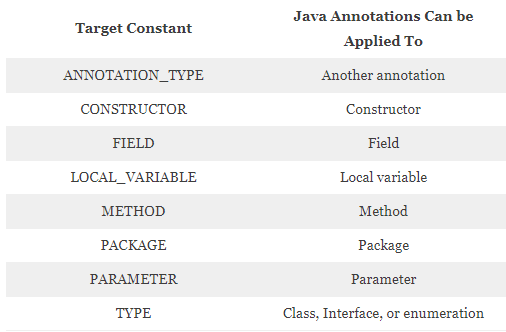

##정의하려는 것이 타입이라면 마커 인터페이스를 사용하라
* 마커 인터페이스(marker interface)
  * 아무 메서드도 담고 있지 않고, 속성을 표시해주는 인터페이스
  * ex> Serializable 인터페이스
* 마커 인터페이스가 마커 애너테이션 보다 나은 점
  * 인스턴스를 구분하는 타입으로 이용 가능
  * 적용 대상을 더 정밀하게 지정할 수 있음
    * 마커 인터페이스는 하위 타입임을 보장 가능
      * ex> Set <- Collection의 하위 타입임을 나타냄
* 마커 애너테이션이 마커 인터페이스 보다 나은 점
  * 애너테이션 시스템의 지원을 받음
* 언제 써야할까?
  * 클래스와 인터페이스 외의 프로그램 요소에 마킹해야 할때 애너테이션을 써야함
    * 모듈, 패키지, 필드, 지역변수 등

  * 마킹된 객체를 매개변수로 받을일이 있다면 마커 인터페이스 사용
    * 컴파일 타임에 오류 검출 가능
  * 애너테이션을 활발히 활용하는 프레임워크에서 사용하려는 마커라면 마커 애너테이션 사용 