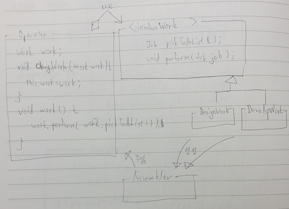
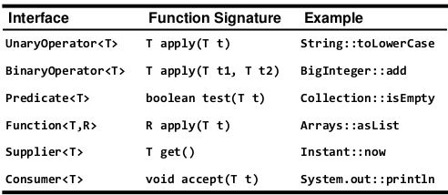

## 표준 함수형 인터페이스를 사용하라
* 람다의 출현으로 템플릿 메서드 패턴 인기 하락
  - template pattern
  
  

  - ex> LinkedHashMap - removeEldestEntry (code - template)
```
  // https://docs.oracle.com/javase/8/docs/api/java/util/LinkedHashMap.html
  protected boolean removeEldestEntry(Map.Entry<Integer, String> eldest) {
    return size() > 100;
  }
```
* 현대적 해법 : 상속대신 함수 객체를 받는 정적 팩터리나 생성자를 제공
  - command strategy.png
  
  
  
  - 함수형 인터페이스 생성 (code - functional1)  
```
  @FunctionalInterface interface EldestEntryRemovalFunction<K, V> {
    boolean remove(Map<K,V> map, Map.Entry<K,V> eldest);
  }  
```
  - 표준 함수형 인터페이스 활용 (code - functional2)
* Standard Functional Interface
  - Operator
    - 반환값과 인수의 타입이 같은 함수
  - Predicate
    - 인수 하나를 받아 boolean을 반환하는 함수
  - Function
    - 인수와 반환 타입이 다른 함수
  - Supplier
    - 인수를 받지 않고 값을 제공하는 함수
  - Consumer
    - 인수를 하나 받고 소비하는 함수 
  
  
  
  - 변형 타입
    - <https://docs.oracle.com/javase/8/docs/api/java/util/function/package-summary.html>

* 전용 함수형 인터페이스 구현 고려사항 (ex-Comparator)
  - 자주 쓰이며, 이름 자체가 용도를 명확히 설명해준다
  - 반드시 따라야 하는 규약이 있다
  - 유용한 디폴트 메서드를 제공할 수 있다.
* @FunctionalInterface 필요성
  - 람다용으로 설계됨을 나타냄
  - 추상 메서드를 오직 하나만 가지고 있도록 강제함(컴파일타임 체크가능)
* 함수형 인터페이스 주의점
  - 서로 다른 함수형 인터페이스를 같은 위치의 인수로 받는 메서드들을 다중정의하지 말아야함
  - ex> ExecutorService의 submit 메소드
    - <https://docs.oracle.com/javase/8/docs/api/java/util/concurrent/ExecutorService.html>